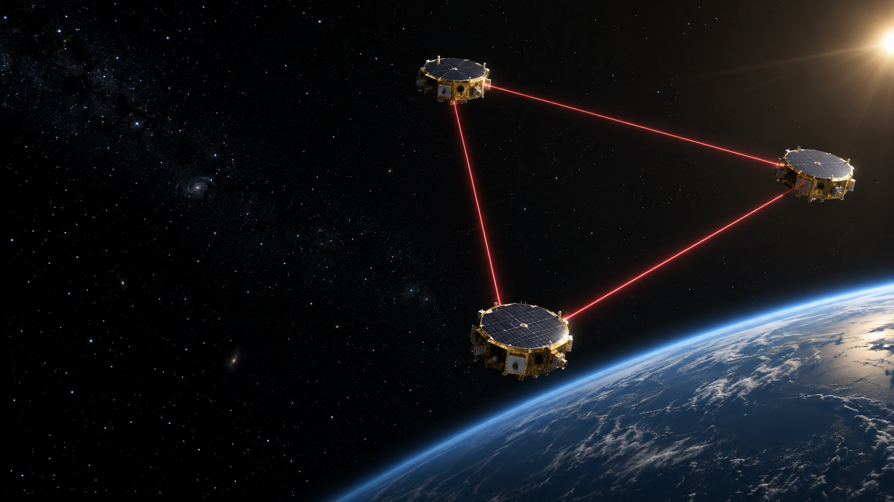

# Xudong Wang

Graduate student at the **Institute of Theoretical Physics, Chinese Academy of Sciences**, working at the intersection of space-based gravitational-wave astronomy, parameter estimation, and scientific machine learning.

## Research

- Space-based gravitational-wave detection with the Taiji observatory
- Massive black hole binary waveform modelling and parameter estimation
- Neural posterior estimation and simulation-based inference
- Uncertainty quantification and frequentist coverage calibration
- Galactic compact-binary foregrounds and population-model uncertainty

My current work studies robust inference for massive black hole binaries in Taiji A/E channels. I am particularly interested in how unresolved Galactic foregrounds and population shifts affect learned posteriors, and how calibrated confidence regions can recover reliable coverage.

## Education

**Institute of Theoretical Physics, Chinese Academy of Sciences** 
Graduate study in Software Engineering

**Huazhong University of Science and Technology** 
Undergraduate study in Cyber Science and Technology

## Links

- [Personal website](https://wangxudong-tech.github.io)
- [GitHub profile](https://github.com/Wangxudong-tech)
